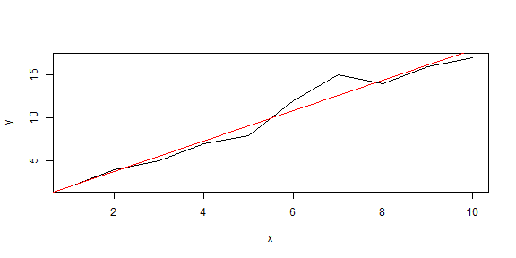

## The Solution - Regression Calculator

<a href="https://jpittard.shinyapps.io/shiny/">https://jpittard.shinyapps.io/shiny</a>

On this page, input your comma-separated values, press Submit, and the application will display the following:

Values
  - Slope
  - Intercept
  
Graphs
  - Actual versus fitted values
  - Residuals versus fitted
  - Scale-location
  - Normal Q-Q
  - Residuals vs. Leverage

---


## Code example

Granted, the code isn't that hard...

```r
x <- c(1,2,3,4,5,6,7,8,9,10); y <- c(2,4,5,7,8,12,15,14,16,17)
plot(x, y, xlab = "x", ylab = "y", type = "l"); abline(lm(y~x), col="red")
```

 

. . . but I did need something simple for the exercise.

---

## Root mean square

Here is an example of some math. It doesn't have much to do with pitching my application, but it does show that I am learning!

<p>$$\sqrt{\frac{1}{n}(x^2_1+x^2_2+...+x^2_n)}$$</p>


